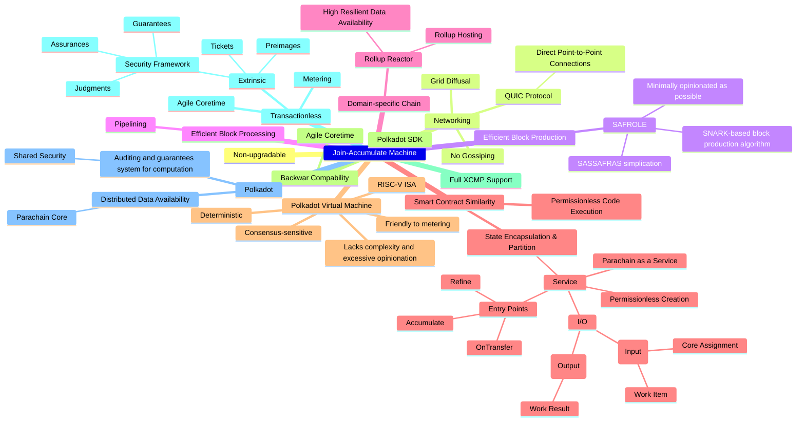

# Awesome JAM

## Content

## Resources
- [JAM Gray Paper](https://graypaper.com/)
- [Polkadot Wiki - Learn JAM chain](https://wiki.polkadot.network/docs/learn-jam-chain)
- [CoreJAM RFC (by Polkadot Fellows)](https://github.com/polkadot-fellows/RFCs/blob/006a9ff07c3d3bc5316c6bf63b05e966e694cc2d/text/corejam.md)
