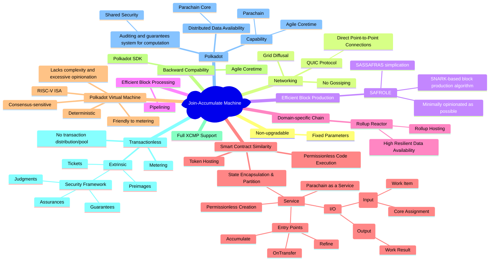
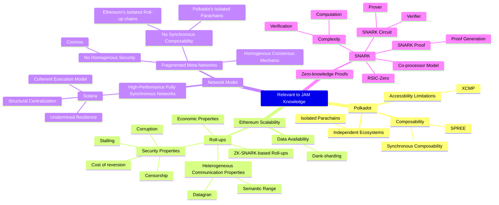

# Knowledge Map for JAM

## About Join-Accumulate Machine

## Polkadot
- Scalable, heterogenous, sharded, multi-chain network
- Permissionless and ubiquitous computer
- Decentralized open-source community
- Digital-native sovereign network
### BREAKDOWN of Polkadot
Link to visualization: https://excalidraw.com/#json=ZBFCg51aQll69Aixf8RCm,68eF4YINi8ugyLep43szkQ
### Decision of Polkadot
- Decisions that can be easily changed in the future.
- Features can be included into the protocol at later time
- Changes can be considered as part of the evolution of the protocol
- Type 1 decisions of Polkadot:
  - XCMP is the core design of Polkadot. Bridges in the blockchain world is insecure and having a transport protocol lyings in the core of the protocol to power shardeds of the network.
  - Any consumer hardware can be used to run the validator node. While Solana relies on 21 Solana experts for the operation of the network.
  - OpenGov
- Type 2 decisions of Polkadot:
  - Parachains would be long term applications-chains
  - Services and agile coretime changed taht viewpoint to also include applications that can spin-up and spin-down at will
  - Even though XCMP is a type 1 decision, the language is not (XCM). The language can be changed but the protocol can't
  - Treasury & Fellowship
### Philosophies of Polkadot
- Less trust more truth. Removing powerful incumbent, decentralizing the power
- Right now, it is hard to create a system that has no trust at all. We can only reduce the level of trust
- Against blockchain maximalism. Chain agnostic. Polkadot aims at becoming a one protocol for the whole network
- "The best blockchain today will not be the best blockchain tomorrow"
- Polkadot aims to be a blockchain that can last for hundred years instead of being the "go-to-market" products.
- Goals of Polkadot
  - Blockchain scalability trilemma: Security, Scalability, Decentralization. Have to sacrifire one of the key attributes to support the another twos.
  - Polkadot tries to solve as much as they can all the aspects of the trilemma.
  - Polkadot's mission is to provide secure, scalable and resilient infrastructure for Web3 applications and services
- Computatal scalability, interoperability, shared security
  - In Cosmos, each shard has its own security
- Code is Law, there is no large voice that can force the network to upgrade or not
- Polkadot has designed at its core a self-funded treasury pool to incentivize the development and evolution of the protocol
  - Trust-free system, without any middleman or authority, anyone can still fund for the development of the protocol
### Shared Security
- Security in blockchain prevents the double-spending attack by verifying the destination and duplication of the transaction through consensus
- Government cuts off the head of the hydra, but more heads grow.
- Economic cost: Slashing the malicious node, which would produce economic lost of the tokens in the network
- Different forms of "Shared Security":
  - Layer 0 security in the underlying core architecutre of the protocol (Polkadot)
  - Rollups: A separate shard from the layer 1 protocol and use the settlement layer to provide security for the rollups
  - Restaking: Eigenlayer, some protocols allow the use of already staked tokens to secure another network, usually through the derivative tokens
- Building blocks of shared security
  - Execution meta-protocol (WASM)
  - Coordination / Validation (Parachain protocol)
  - Security hub / Settlement layer (Relaychain)
- Polkadot Client is basically a WASM executor
- Parchain Validation
  - Maximizing Scaling: Security is as shared as possible, execution is as shared as possible
  - Execution Sharding:
    - Process of distributing blockchain execution responsiblities across a validator set
  - PoV is distributed to the validators and use enrasure coding to trace back the full data of the PoV. If one validator has a malicious action, it will be reported by the spreaded out validator set
- Polkadot Native Shared Security
  - Pros
    - Protocol level handling of sharding, shared security, and interoperability
    - Easy to develop STF: Anything that compiles to WASM
    - Probably the best time to finality, usually under a minute.
    - Data availability provided by the existing validators.
    - Much less concern of centralization from collators vs sequencers and provers.
  - Cons
    - Cetain limitations enforced to keep parachains compatible with the parachains protocol
      - WASM STF
      - No Custom Host Function
      - Constrained Execution Environment
    - WASM is unfortunately still 2x slower than native compilation
    - Requires lot of data being provided and available in PoV

### Multichain Network - Parachains
- What is Parachain Consensus?
  - Three pillars of Polkadot: NPoS, Gov, Parachains
    - NPoS: Provide player information in the game
    - Gov: Figure out the way to adjusting the game
    - Parachains: Scheduling, Execution and Consensus
  - NPOS:
    - Every 24h, an algorithmic election is held and a set of 300 validators is chosen - they will be the active validator set
    - Active set of validators is backed by ~50% if the total DOT supply
    - The stake is evenly distributed between the active validators so the all have equal voting power in the upcoming game
- Goals of Parchain Consensus: `Scalabilityyyyy`
  - Sharding crucially allows us to parallelize. Ensure not too much duplication of data. Everyone executes everything is not scalable at all

### Execution Sharding in Polkadot
- Issue in scalability in blockchain: Everyone checking everything is sacrificing scalability for security
- Optimiziation: Escalation when faults detected, everyone will check everything. We temporarily break sharding to ensure security (Only the shard which is malicious)

### Data availability on Polkadot
- If we bring all the data from the parachain to the relaychain, one day it can be recorded up to 72GB
- How do we ensure a  piece of data is retrievable without storing it on every single node forever?
- Incorrectness can be proven (merkle proofs), but unavailability can't
- Polkadot Data Availability layer

## Relevant Knowledge in the Gray Paper

## JAM Breakdown
### What is JAM?
- Unchanged
  - Philosophies of Polkadot
  - Goals of Polkadot
    - Parallel Execution and Heterogenous Sharding
    - Shared Security
    - Interoperability
- Changed
  - Upgradability of the core protocol
    - Substrate -> JAM chain
  - Services (as a superset of parachains)
  - WASM -> PolkaVM (RISC-V)
  - Synchronous Communication Capabilities
### Execution Meta-protocol - [PolkaVM](https://github.com/koute/polkavm)
Virtual machine is used in two important parts of the Polkadot system: PVF and STF (State Transition Function)
- About WebAssembly
  - Open, wel designed standard
  - Huge ecosystem, multiple production-quality VMs available
    - Wasmtime
    > And Wasmer, Wasmi, WAVM, wazero, Wasm3, WasmEdge...
      - Written in Rust by a team of world-class VM engieners
      - Compiles WASM into native code (fast execution)
      - Secure, very heavily tested and fuzzed
      - Highest quality Wasm VM out there
    - But
      - Does not guarantee 100% determinism
        - Guest stack is shared with the host stack (For example, some node calculation return 1 but some return 3 due to the different in the non-deterministic stack frame)
        - WASM does not have a limit on how many function we can call inside each other
        - Compilation times are not guaranteed to be O(n) and are quite slow. (PVF has prechecking compiles the program first offline to check if can be accepted)
        - Missing features for PolkaJAM:
          - [Support for suspend + resume](https://github.com/WebAssembly/design/issues/1294)
          - Blockchain-grade gas metering
          - Dynamic guest page fault handling
          - Is a stack machine, so it's hard to high performance and guaranteed O(n) compilation (needs register allocation, which is NP-complete). Limited number of registers but inifinite number of variables.
          - Doesn't support lazy execution. For example, if we have 1MB program and we only want to execute a 100KB function, we have to load the whole 1MB to execute only 100KB function.
          - A lot of features we don't need or want
            - 172 instructions in WebAssembly 1.0
            - 220 instructions in WebAssembly core as today
            - Baseline spec is constantly growing
              - 64-bit memory
              - https://github.com/CosmWasm/cosmwasm/issues/1727
    - We want an ISA which is a register machine, simple, has a stable baseline, portable, well defined and standardized, already widely supported by compilers, guaranteed to be supported into the future, has enough features to compile arbitrary existing programs, doesn't force on us features which we don't need.
  - Excenllent compiler and tool chain support
- About RISC-V
  - CPU instruction set, like x86 or ARM
  - Easy to write a recompiler (register-machine)
  - Simple and standadized. Baseline spec has only 47 instructions
  - Existing compilers and toolchains can already easily target it. We don't need LLVM backend for RISC-V
- PolkaVM - RISC-V based virtual machine made for a blockchain system
  - 300x compilation time faster than Wasmtime
  - Custom bytecode designed for efficiency and speed
    - Compatible with lazy execution
  - Programs execute as fast as `wasmtime` while being over 320x faster to compile
    - Most PolkaVM instructions can be translated 1-to-1 into native code.
    > When compiling to x86, we don't need the optimizer. Precompiler is 1000 lines of code.
    - Highly optimized implementation to find the limits of how fast we can go
  - Guaranteed linear time compilation
  - Guaranteed 100% determinism
  - Sandboxing is feature complete, more secure than `wasmtime`
    - ... guest programs run as another process
    - ... guest programs run in another namespace (like Docker, but built-in)
    - ... guest programs run under a strict seccomp sandbox. (how the program communicates with the operating system)
  - Can run arbitrary C, C++ and Rust programs
  - Can be used as an experimental executor in Substrate (can run Rococo) 

### Service Model

## Gray Paper Notes
### About the limitations of Polkadot in its parachain model

### Data availability scaling in Ethereum

## Resources
- [JAM Gray Paper](https://graypaper.com/)
- [Polkadot Wiki - Learn JAM chain](https://wiki.polkadot.network/docs/learn-jam-chain)
- [CoreJAM RFC (by Polkadot Fellows)](https://github.com/polkadot-fellows/RFCs/blob/006a9ff07c3d3bc5316c6bf63b05e966e694cc2d/text/corejam.md)
- [sub0 Asia 2024 keynote - Gavin Wood on JAM A-Z](https://www.youtube.com/watch?v=tdvqkKdFTlw)
- [Solidity compiler for PolkaVM](https://github.com/xermicus/revive)
- Polkadot Virtual Machine Development
  - [Stackoverflow - Registerd-based VM vs Stack-based VM](https://stackoverflow.com/questions/164143/registers-vs-stacks)
  - [Virtual Machine Showdown: Stack Versus Registers](https://static.usenix.org/events/vee05/full_papers/p153-yunhe.pdf)
  - [Polkadot Forum Discussion: eBPF contracts hackathon](https://forum.polkadot.network/t/ebpf-contracts-hackathon/1084)
  - [Polkadot Forum Discussion: Exploring alternatives to WASM for smart contracts](https://forum.polkadot.network/t/exploring-alternatives-to-wasm-for-smart-contracts/2434)
### Ethereum Resources
- [Ethereum Wire Protocol](https://github.com/ethereum/devp2p/blob/master/caps/eth.md)
- [Ethereum Snap Protocol](https://github.com/ethereum/devp2p/blob/master/caps/snap.md)
- [Ethereum White Paper](https://ethereum.github.io/yellowpaper/paper.pdf)
- [Ethereum Metering Wiki](https://corepaper.org/ethereum/metering/)
- [Broken Metre - Attacking Resource Metering in EVM](https://arxiv.org/pdf/1909.07220)
### Solana Resources
- [Turbine - Block propagation protocol on Solana](https://www.helius.dev/blog/turbine-block-propagation-on-solana): Why do we want to know about Turbine? The way Relaychain availability stage in the block inclusion pipeline works is quite similar to how Turbine works. In the context of the Polkadot's Relaychain, PoV is broken down into chunks (blocks are broken down into shreds in Solana) and propagated to active validator nodes of the Relaychain. Then erasure coding algorithm Reed Solomon is also used to ensure the validity and avilability of the validity proofs across the network.
> Solana Turbine: Validator A builds and proposes a block. Validator 1 first breaks the block into sub-blocks called shreds through a process called shredding. Shredding splits the block data into Maximum Transmission Units (MTU)-sized data shreds (the maximum amount of data that can be sent from one node to the next without fragmenting it into smaller units) and generates corresponding recovery shreds via the Reed-Solomon erasure coding scheme. This scheme aids in data recovery and ensures data integrity during transmission, which is crucial for maintaining the security and reliability of the network.
