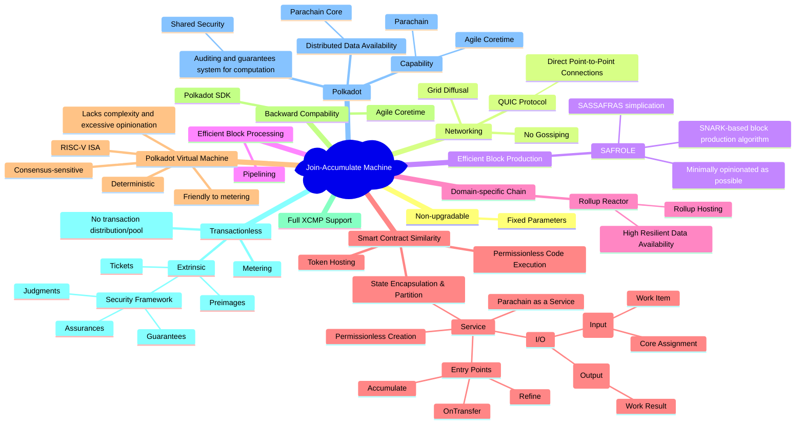
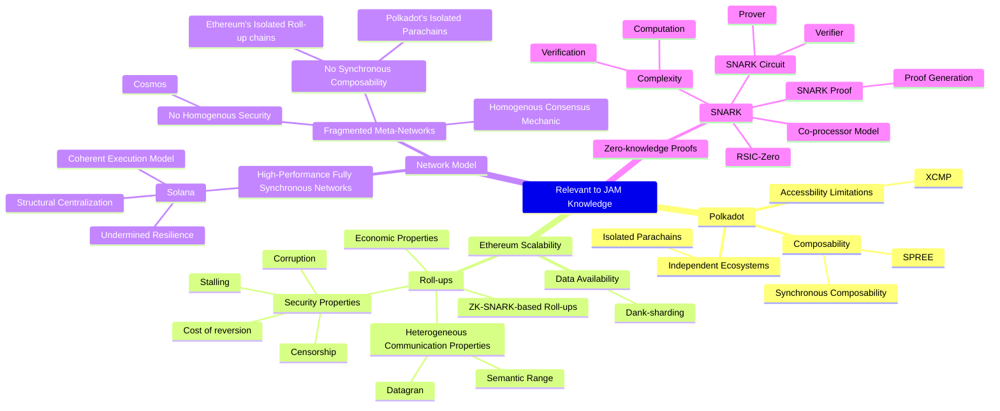

# Knowledge Map for JAM
## About Join-Accumulate Machine

## Relevant Knowledge in the Gray Paper

## JAM Breakdown
### Service Model

## Gray Paper Notes
### About the limitations of Polkadot in its parachain model

### Data availability scaling in Ethereum

## Resources
- [JAM Gray Paper](https://graypaper.com/)
- [Polkadot Wiki - Learn JAM chain](https://wiki.polkadot.network/docs/learn-jam-chain)
- [CoreJAM RFC (by Polkadot Fellows)](https://github.com/polkadot-fellows/RFCs/blob/006a9ff07c3d3bc5316c6bf63b05e966e694cc2d/text/corejam.md)
- [sub0 Asia 2024 keynote - Gavin Wood on JAM A-Z](https://www.youtube.com/watch?v=tdvqkKdFTlw)

